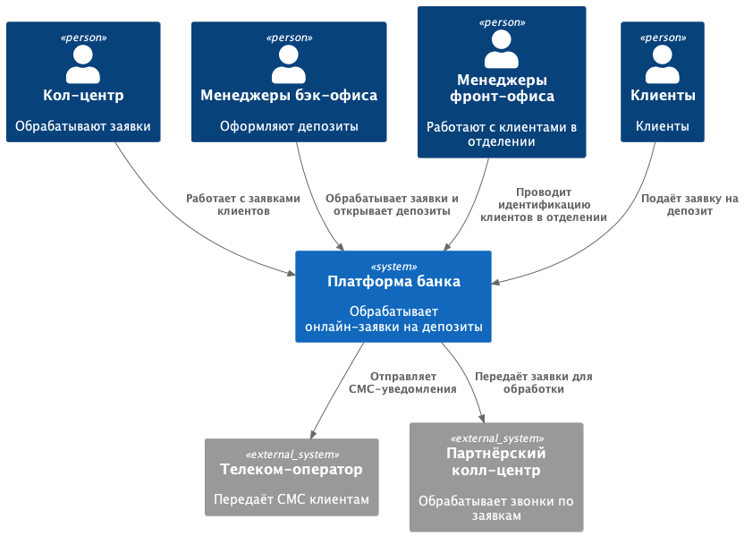
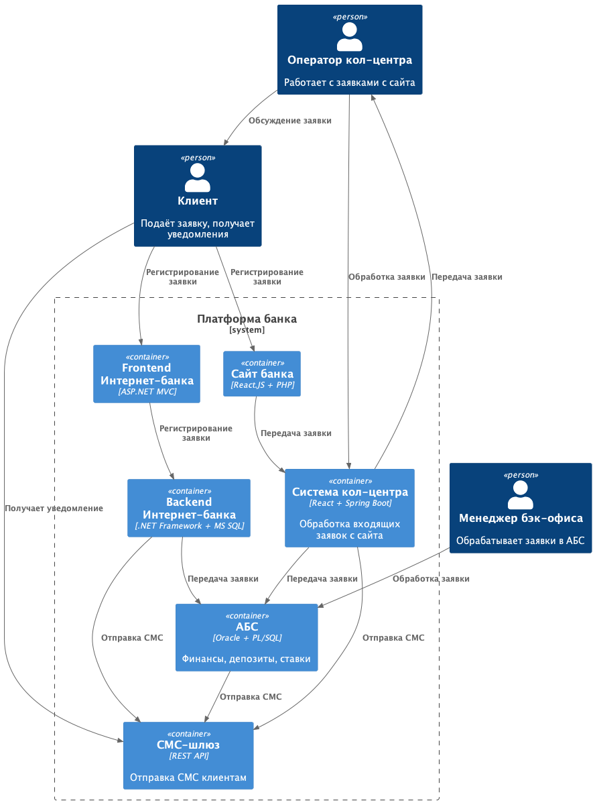

### **Название задачи: MVP Онлайн открытия депозитов** 
### **Автор: Максим Болгарин**
### **Дата: 4 мая 2025 года**

### **Функциональные требования**
|**№**|**Действующие лица или системы**|**Use Case**|**Описание**|
| :-: | :- | :- | :- |
| UC1 | Новый клиент | Просмотр списка депозитов на сайте | Новый клиент заходит на сайт банка и просматривает список доступных депозитных продуктов с актуальными ставками. |
| UC2 | Новый клиент | Подача заявки на депозит через сайт | Новый клиент выбирает депозит на сайте, вводит свои ФИО и номер телефона в форме заявки и отправляет ее |
| UC3 | Бэкенд сайта | Передача заявки в систему кол-центра | После успешной отправки заявки новым клиентом на сайте, система сайта передает данные заявки в систему кол-центра для дальнейшей работы |
| UC4 | Существующий клиент | Просмотр списка депозитов в Интернет-банке | Существующий клиент заходит в Интернет-банк и просматривает список доступных депозитов, включая актуальные ставки, рассчитанные для него. |
| UC5 | Существующий клиент | Подача заявки на открытие депозита в Интернет-банке | Существующий клиент выбирает депозит, указывает счет и сумму желаемого депозита, инициируя процесс подачи заявки. |
| UC6 | Система СМС-подтверждений | Подтверждение заявки на депозит СМС-кодом | Для подтверждения заявки на депозит клиент получает СМС-код и вводит его в соответствующее поле в интерфейсе |
| UC7 | Менеджер бэк-офиса | Управление ставками по депозитам | Менеджер бэк-офиса входит в систему управления ставками и усправляет ставками по депозитным продуктам |
| UC8 | Менеджер бэк-офиса | Обработка заявки на депозит | Менеджер бэк-офиса получает заявку, проверяет данные, связывается с клиентом, согласовывает финальные условия. |
| UC9 | АБC | Информирование клиента о подтверждении | После того как менеджер подтвердил условия депозита, система автоматически шлет СМС клиенту с подтверждением |
| UC10 | АБС | Информирование клиента об открытии депозита | После фактического открытия депозита система инициирует отправку СМС клиенту об успешном открытии. |

### **Нефункциональные требования**
|**№**|**Требование**|
| :-: | :- |
| 1 | Пользовательские интерфейсы на сайте и в интернет банке должны быть интуитивно понятными, удобными и минимизировать количество шагов для выполнения целевых действий. |
| 2 | Визуальное оформление пользовательских интерфейсов должно соответствовать утвержденной в банке системе дизайна. |
| 3 | Весь трафик между браузером нового клиента и веб-сервером сайта должен быть зашифрован для защиты передаваемых данных. |
| 4 | Весь трафик между клиентом и серверами Интернет-банка должен быть зашифрован для защиты данных клиента и операций. |
| 5 | Сервисы подачи заявок на сайте и в интернет-банке должны быть доступны для пользователей не менее 99.9% времени. |
| 6 | Функциональность подачи заявок должна быть доступна пользователям круглосуточно. |
| 7 | Время ответа системы на действия пользователя в интерфейсах сайта и интернет-банке должно быть максимально быстрым. |
| 8 | Компоненты системы должны поддерживать горизонтальное масштабирование. |
| 9 | Должна быть создана и поддерживаться в актуальном состоянии техническая документация для разработанной функциональности. |

### **Решение**

#### Диаграма контекста

#### Диаграма контейнеров

#### Описание взаимодействия
1. Клиент через сайт подает заявку, с ним связывается сотрудник кол центра и обсуждает условия
2. Клиент через интернет-банк подаёт заявку, данные поступают в АБС, где обрабатываются бэк офисом
3. Клиент получает СМС на разных этапах движения заявки

#### Технологии
Используются существующие технологии, происходит доработка

### **Альтернативы**

1. Прямая интеграция между интернет-банком и АБС. Плохо, так как имеем высокую нагрузку на АБС, что может привести к падению доступности сервиса

**Недостатки, ограничения, риски**

1. Требуется дополнительная разработка, что влечет финансовые вложения в проект
2. Платформа интернет-банка несовместима с Kafka, что ограничивает масштабирование

