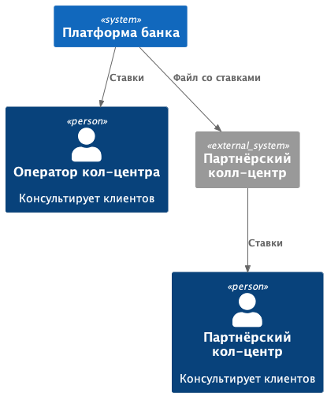
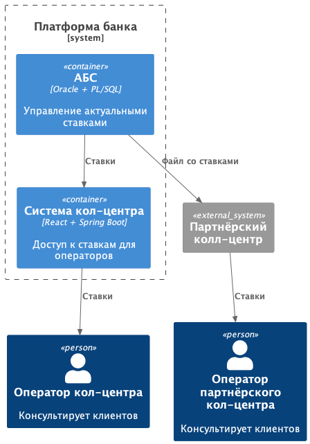

### **Название задачи: Передача ставок в кол-центр** 
### **Автор: Максим Болгарин**
### **Дата: 4 мая 2025 года**

### **Функциональные требования**
| **№** | **Действующие лица или системы** | **Use Case**                                                                |
| :-: | :- | :- |
| UC1  | Оператор кол-центра   | Видеть актуальные ставки в интерфейсе для консультации клиентов |
| UC2  | Партнёрский кол-центр            | Получать файл со ставками, который будет загружен в систему для предоставления информации по ставкам |
| UC3  | Система банка                    | Раз в день в 8:00 по UTC+3 создавать и отправлять партнерскому кол центру email с актуальным файлом со ставками        |

### **Нефункциональные требования**
|**№**|**Требование**|
| :-: | :- |
| 1  | Кол-центр банка должен получать ставки в интерфейсе без задержек    |
| 2  | Партнёрский кол-центр способен принять только файл со ставками, у него нет API |
| 3  | Передача файла должна быть безопасной |

### **Решение**

#### Диаграма контекста

#### Диаграма контейнеров

#### Описание взаимодействия
1. Оператор кол центра загружает через свою систему ставки
2. Партнерский кол центр получает от АБС файл со ставками и передает ставки операторам

#### Технологии
Используются существующие технологии, происходит доработка

### **Альтернативы**

1. Писать микросервисы вместо доработок монолита - требует соответствующую команду разработки
2. Использовать API вместо файла - нет возможности у партнерского кол центра

**Недостатки, ограничения, риски**

1. Передача файла по email несет риски для безопасности
